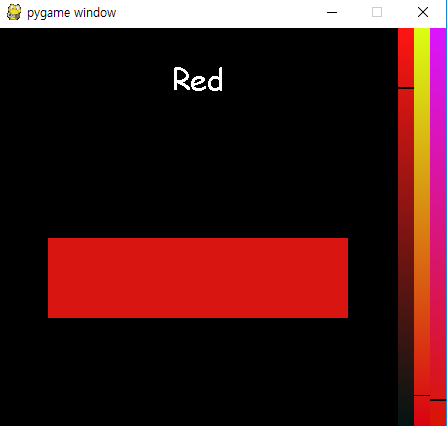

# Color to Name
사용자에게 색깔의 이름을 물어보는 작업을 거쳐
데이터를 얻는 프로그램입니다.

100개의 질문으로 사용자에게 색깔의 이름을 물어본후
사용자가 CUI로 대답합니다.

이후 colors.dat/names.dat 파일로 출력이 됩니다.

colors.dat 파일에는
각 줄에
```
r,g,b:index
```
형식으로 기재되어있고

names.dat 파일에는
각 줄에
```
name, index
```
형식으로 기재 되어있습니다.

## sample machine learning.py
해당 데이터로 학습을 하는 프로그램 입니다.
색깔을 지정해주면 제일 근접한 색깔의 이름을 출력합니다.

### 실행화면
